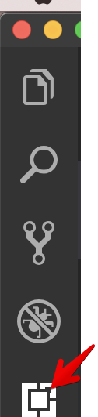
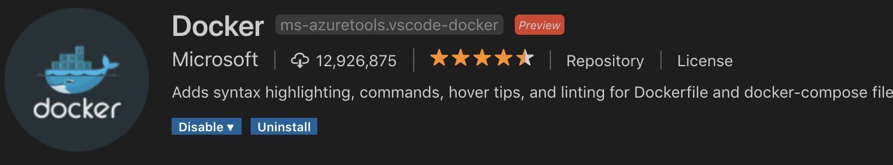
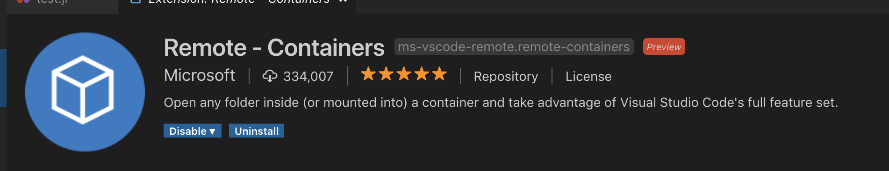
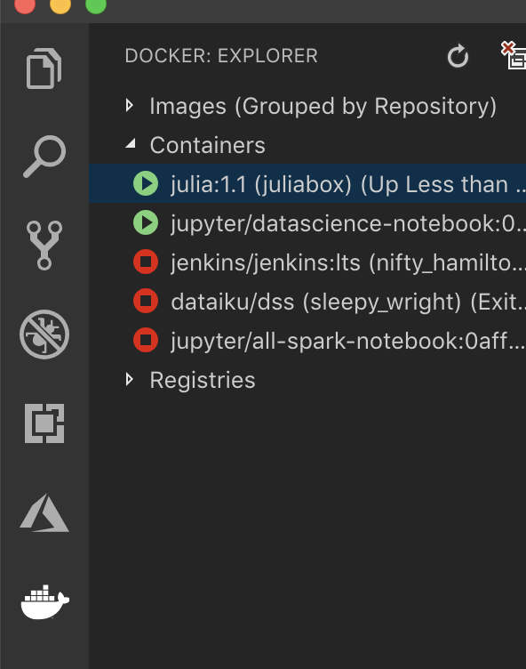
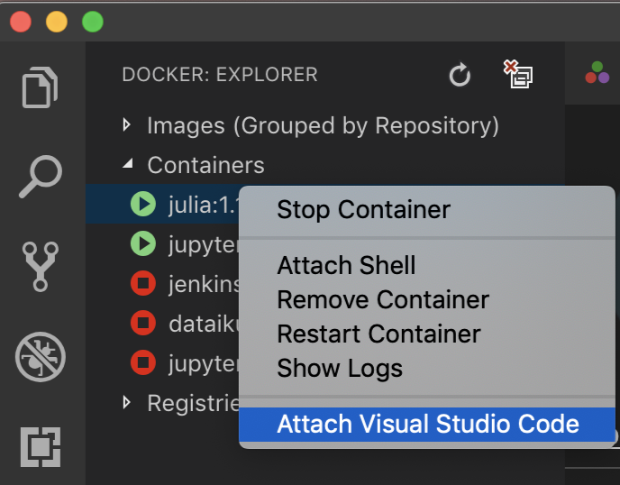
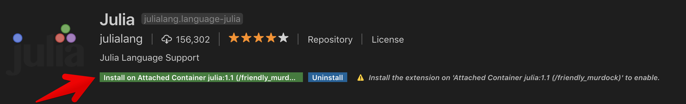
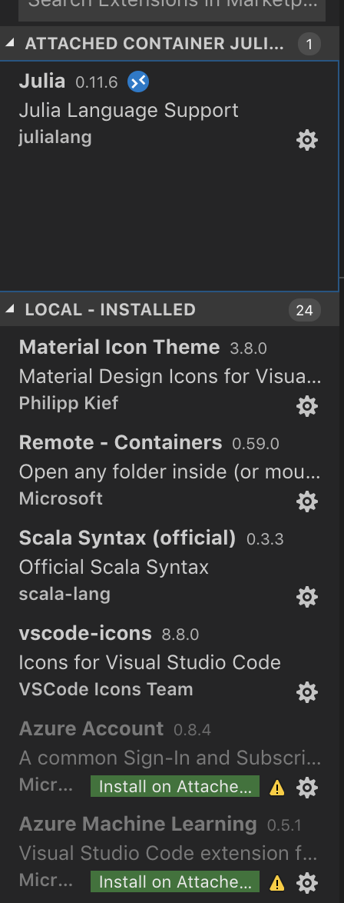

# Julia Scientific Computing

#### Steps to configure your VSCode to attache to a Docker Container [Julia]

This assumes you have both VSCode and Docker already installed. For more information on how to install check out:

* Installing Docker https://docs.docker.com
* VSCode installation https://code.visualstudio.com/download


1. Once you have both products installed. Make sure that Docker is up and running.
2. Download Julia image. From the terminal type:

```bash
docker pull julia:1.1
```


3. Create a container. 

**option 1**

```bash
docker run -name="juliabox" -it julia:1.1
```

**option 2 ** if you want to run the container and mount a volume (shared folder) then run

```bash
docker run --name="juliabox" -it -v <your local path>:/home/ julia:1.1
```

**option 3**

from VSCode, click on the Docker icon. Under Images, right click Julia image and select “Run Interactive”.

Now that we have the container running. Let’s open VSCode. 

4. Click the Extension icon on the left side 



5. Search for Docker extension. **Install Docker** extensionwhich is a Microsoft official extension for VSCode



6. **Install Remote - Containers**. Which is also a Microsoft official extension. This will allow you to mount into a container. When mounted, it will also attempt to install Vscode server inside the container. 



7. With the Docker extension installed. You will see the Docker icon on the left bar. When clicked it should toggle the Docker Explorer. You can see your images, and you can view your running containers (and their status).




With the **Remote-Containers** extension you will see an additional option when you right click on a running container. Click **Attach Visual Studio Coide**. This will open a new window. 




It may take few seconds as VSCode will attempt to install and setup the VScode server on your behalf. 

Once connected. Click on the **Extensions** icon, now you will see a split display between extensions installed locally and extensions installed on Attached Container. If you have the Julia extension installed locally, you will see an option to install it on the attached container. Otherwise, you can just search for it and you will get an option from the install menu.




Once it is installed. You will see something like this:




8. Enjoy development. You can follow the same process to connect VSCode to any container (e.g. Rust, Haskell, Python ..etc.)